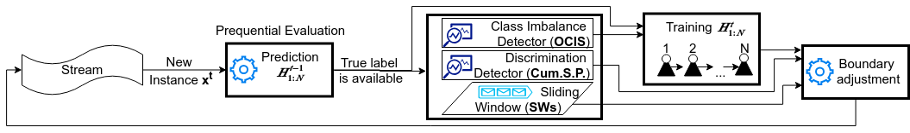

# FABBOO

Data-driven algorithms are employed in many applications, in which data become available in a sequential order, forcing the update of the model with new instances. In such dynamic environments, in which the underlying data distributions might evolve with time, fairness-aware learning cannot be considered as a one-off requirement, but rather it should comprise a continual requirement over the stream. Recent fairness-aware stream classifiers ignore the problem of class distribution skewness. As a result, such methods mitigate discrimination by rejecting minority instances at large due to their inability to effectively learn all classes. 
In this work, we propose FABBOO, an online fairness-aware approach that maintains a valid and fair classifier over a stream. FABBOO is an online boosting approach that changes the training distribution in an online fashion based on both stream imbalance and discriminatory behavior of the model evaluated over the historical stream. 
Our experiments show that such long-term consideration of class-imbalance and fairness are beneficial for maintaining models that exhibit good predictive- and fairness-related performance.

This repository contains a MOA implementation of the FABBOO algorithm.

Baselines are also implemented in MOA. In order to replicate the experiments, first decompress the dataset files into the Data directory.

Dataset files are located [here](https://github.com/iosifidisvasileios/OnlineFairBalancedBoosting/tree/master/Data)
